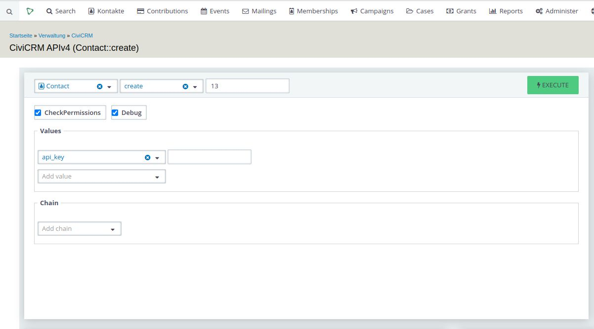

# Twingle API: Creating a Twingle User in CiviCRM

After the installation of the Twingle API extension, various configuration steps must be carried out so that the connection functions smoothly. Among other things, certain configurations must be made regarding the general CiviCRM administration. Among other things, there must be in either case a Twingle user in the CiviCRM contacts.

## Take over user

The Twingle API only works correctly if a user with the name **Twingle API** exists in CiviCRM. Make sure that you have previously created the corresponding user your CMS user administration (Drupal, Wordpress ...). 

Here, the corresponding steps are described by way of example when using Drupal.

1. In CiviCRM, go to **Administer**. 

2. In the **Users and Permissions** section, choose **Synchronize Users to Contacts**.

This function checks each user record in Drupal for a contact record in CiviCRM. If there is no corresponding contact record for a user, a new one will be generated. Check this in your CiviCRM contact management.

## Assign API key for the Twingle API user

The Twingle API user in CiviCRM needs his own API key. The API key is assigned with the help of the API Explorer in CiviCRM.

1. Select the Twingle API user in CiviCRM.

2. Look for the corresponding **CiviCRM ID** and remember the ID.

3. Go to **Support/Developper/API Explorer v4**.

4. Enter **Contact** in the entity field, **create** in action field and the **ID** of the Twingle User in the **index** field.

5. In the values field, select **api_key**. 

6. Enter the API key for the Twingle API user in the **add value** field.

7. Click on **Execute**.

