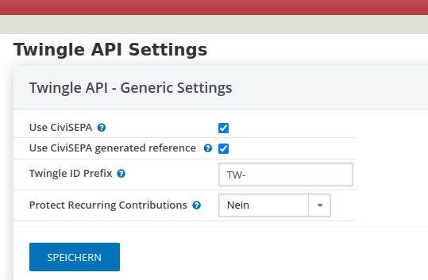

# Activating SEPA for the Twingle API extension in CiviCRM

After the installation of the extension, various configuration steps must be carried out so that the connection functions smoothly. If you would like to create and manage the SEPA mandates yourself for the one-off and recurring payments with CiviCRM, you have to make some settings regarding the SEPA connection.

1. In CiviCRM, go to **Administer**.

2. Choose **Twingle API configuration**.
   
    

3. Then click on **Configure extension settings**.
   
     

4. Tick the boxes **Use CiviSEPA** and **Use CiviSEPA generated reference**.
   These options can only be activated if CiviSEPA is installed and used. If it is not activated, the administration of SEPA mandates takes place in Twingle.

5. Write **TW-** in the **Twingle ID Prefix** field.
   To avoid overlaps when assigning CiviCRM IDs and Twingle transaction IDs, a prefix should be assigned here, e.g. "TWNGL" or "Twingle" or similar.
   Attention: The prefix should not be changed later, otherwise problems may occur.

6. In the **Protect Recurring Contributions** field select **No**.
   If you choose Yes, all recurring donations created by Twingle can no longer be changed in CiviCRM, but must then be changed accordingly in Twingle. If no recurring payments are processed via Twingle, but only one-off donations, then this does not need to be activated. Otherwise, we strongly recommend setting the button here to **Yes** so that there are no discrepancies between CiviCRM and Twingle.
   
      
